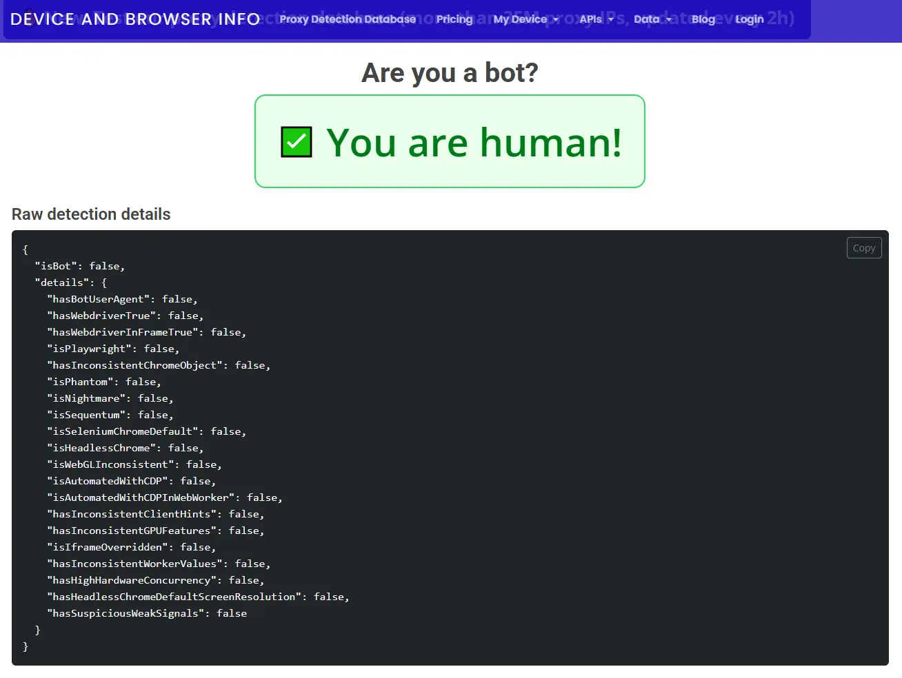

# Chrome DevTools MCP with Rebrowser Anti-Detection Patches

This project wraps [chrome-devtools-mcp](https://github.com/ChromeDevTools/chrome-devtools-mcp) with [rebrowser-patches](https://github.com/rebrowser/rebrowser-patches) to make AI agents undetectable by anti-bot systems like Cloudflare and DataDome.



## 🤖 AI

Yes, I used AI. I also committed the full conversations as the real design documents (`.ai-conversations/` - private submodule, ask me for access).

They're private because I haven't scrubbed my file paths and trash talk, not because I'm hiding anything.

Code is MIT. What license applies to human-AI conversation transcripts is an open question. Literally. Nobody knows yet.

## Quick Start

### Prerequisites

- **Node.js** ≥ 20.19.0 LTS
- **Chrome** running with remote debugging enabled (go to `chrome://inspect/#remote-debugging`)
- **Git** installed (provides `patch.exe` on Windows, needed for applying patches)

### Usage via `npx` (recommended)

No cloning or manual setup needed. Just configure your MCP client:

```json
{
  "mcpServers": {
    "chrome-devtools-mcp-rebrowser": {
      "disabled": false,
      "timeout": 60,
      "type": "stdio",
      "command": "npx",
      "args": [
        "-y",
        "@liqi0816/chrome-devtools-mcp-rebrowser@latest",
        "--auto-connect",
        "--performance-crux=false",
        "--usage-statistics=false",
        "--category-emulation=false",
        "--category-performance=false",
        "--category-network=false"
      ]
    }
  }
}
```

That's it. The `postinstall` script automatically applies all patches after `npm install`.

### Usage from source (development)

```bash
git clone <repo-url>
cd chrome-devtools-mcp-rebrowser
npm install          # postinstall applies patches automatically
```

Then configure the MCP server to use the local entry point:

```json
{
  "mcpServers": {
    "chrome-devtools-mcp-rebrowser": {
      "disabled": false,
      "timeout": 60,
      "type": "stdio",
      "command": "node",
      "args": [
        "/path/to/launch.mjs",
        "--auto-connect",
        "--performance-crux=false",
        "--usage-statistics=false",
        "--category-emulation=false",
        "--category-performance=false",
        "--category-network=false"
      ]
    }
  }
}
```

## How It Works

`chrome-devtools-mcp` is Google's official MCP server for Chrome DevTools. It bundles its own copy of Puppeteer (v24.39.1) internally. This project intercepts its `puppeteer.connect()` and `puppeteer.launch()` calls and redirects them through a separately installed, rebrowser-patched version of `puppeteer-core`.

### Architecture

```
launch.mjs (entry point)
  │
  ├─ Imports patched puppeteer-core (node_modules/puppeteer-core)
  │   └─ puppeteer-core@24.39.1 + rebrowser-patches applied
  │
  ├─ Imports bundled puppeteer from chrome-devtools-mcp
  │   └─ node_modules/chrome-devtools-mcp/build/src/third_party/index.js
  │
  ├─ Monkey-patches bundled puppeteer's connect()/launch() methods
  │   to redirect through the patched puppeteer-core
  │
  └─ Delegates to chrome-devtools-mcp's main entry point

postinstall.mjs (runs after npm install)
  │
  ├─ Applies rebrowser-patches to puppeteer-core (with --fuzz=10)
  │
  └─ Applies DevToolsConnectionAdapter.js patch to chrome-devtools-mcp

DevToolsConnectionAdapter.js (patched)
  │
  └─ Blocks Runtime.enable calls from DevTools Universe models
     to prevent CDP detection via the separate CDP session
```

### Why the Monkey-Patching?

- `chrome-devtools-mcp` bundles Puppeteer in a single rollup file (`third_party/index.js`), so you can't simply swap out `puppeteer-core` via `package.json`.
- `rebrowser-puppeteer` (the drop-in replacement) is only available up to v24.8.1, but `chrome-devtools-mcp@0.20.3` requires Puppeteer v24.39.1 APIs (e.g., `page.emulateFocusedPage()`).
- Solution: install `puppeteer-core@24.39.1` separately, apply `rebrowser-patches` to it, then redirect the bundled Puppeteer's calls through the patched version.

## Flags

All flags from `chrome-devtools-mcp` are passed transparently. Key ones:

| Flag | Description |
|------|-------------|
| `--auto-connect` | Connect to a running Chrome instance (requires remote debugging enabled) |
| `--browser-url http://127.0.0.1:9222` | Connect via HTTP URL |
| `--ws-endpoint ws://...` | Connect via WebSocket |
| `--headless` | Run in headless mode (Warning: more detectable) |
| `--no-usage-statistics` | Disable telemetry |

## Rebrowser Patches Environment Variables

You can fine-tune the anti-detection patches:

| Variable | Values | Default |
|----------|--------|---------|
| `REBROWSER_PATCHES_RUNTIME_FIX_MODE` | `addBinding`, `alwaysIsolated`, `enableDisable`, `0` (disable) | `addBinding` |
| `REBROWSER_PATCHES_SOURCE_URL` | Any string, or `0` to disable | `app.js` |
| `REBROWSER_PATCHES_UTILITY_WORLD_NAME` | Any string, or `0` to disable | `util` |
| `REBROWSER_PATCHES_DEBUG` | `1` to enable debug logging | (disabled) |

## What the Patches Fix

### rebrowser-patches (applied to puppeteer-core)

1. **`Runtime.Enable` leak** — The primary detection vector. Anti-bot systems detect that `Runtime.Enable` was called (used by Puppeteer/Playwright). The patch avoids calling it and uses alternative methods to manage execution contexts.

2. **`sourceURL` fingerprint** — Puppeteer adds `//# sourceURL=pptr:...` to evaluated scripts. The patch changes it to `//# sourceURL=app.js`.

3. **Utility world name** — The default `__puppeteer_utility_world__` name is changed to `util`.

4. **Browser `_connection()` method** — Exposes the CDP connection for advanced use cases (not detectable by websites).

### DevToolsConnectionAdapter.js (applied to chrome-devtools-mcp)

5. **DevTools Universe `Runtime.Enable` leak** — Even with rebrowser-patches applied to puppeteer-core, `chrome-devtools-mcp` creates a *separate* CDP session per page via `page.createCDPSession()` in `DevtoolsUtils.js` and feeds it to a DevTools Universe. The Universe's RuntimeModel then calls `Runtime.enable` on that session — completely bypassing the patched puppeteer-core. We patch `DevToolsConnectionAdapter.js` to intercept and block `Runtime.enable` calls in the `send()` method, consistent with how rebrowser-patches handles it inside Puppeteer's FrameManager.

### What the DevTools Universe CDP session is used for

`chrome-devtools-mcp` creates a per-page DevTools Universe (a lightweight instance of Chrome DevTools' SDK) for **source-map-aware stack trace symbolication** and **error introspection**:

| Feature | Model | What it does |
|---------|-------|-------------|
| Stack trace resolution | `DebuggerModel` + `DebuggerWorkspaceBinding` | Receives `Debugger.scriptParsed` events, downloads source maps, retranslates raw CDP stack frames into original source locations for `get_console_message` output |
| Exception details | `RuntimeModel` | Calls `Runtime.getExceptionDetails` to resolve full error info from `RemoteObject` references, including recursive `.cause` chain |
| Skip-all-pauses | `DebuggerModel` | Immediately calls `Debugger.setSkipAllPauses({skip: true})` so the MCP session never interferes with the user's DevTools debugging |

### Tradeoff of blocking `Runtime.enable`

Blocking `Runtime.enable` on the Universe session means the `RuntimeModel` won't receive execution context events, which degrades `getExceptionDetails()` (error cause chain resolution in `get_console_message`). However:

- **Core MCP tools are unaffected** — `evaluate_script`, page snapshots, navigation, clicking, typing, screenshots all use Puppeteer APIs directly, not the Universe session.
- **Console message collection is unaffected** — `PageCollector` listens on Puppeteer's own CDP session (`page._client()`), not the Universe session.
- **Stack traces from `DebuggerModel` still work** — `Debugger.enable` is not blocked, so source-map-aware stack traces continue to function.
- **Only error cause chains degrade** — The recursive `.cause` lookup via `RuntimeModel.getExceptionDetails()` may fail silently, omitting cause details from console error output.

This is an acceptable tradeoff since `Runtime.enable` is the primary CDP detection vector used by anti-bot systems.

## Troubleshooting

### "Could not connect to Chrome"
- Make sure Chrome is running
- Enable remote debugging: go to `chrome://inspect/#remote-debugging`
- Check that `DevToolsActivePort` file exists in Chrome's user data directory

### Patch fails with "FAILED" hunks
- If CJS/ESM hunks fail, the puppeteer-core version may have changed too much. Try adjusting the `--fuzz` value or manually applying the changes

### "emulateFocusedPage is not a function" (or similar)
- Version mismatch: ensure `puppeteer-core` in `package.json` matches the version in `chrome-devtools-mcp`'s `devDependencies` (currently `24.39.1`)

### Postinstall fails — "`patch` command not found"
- On Linux/macOS: `patch` is usually pre-installed. If not: `sudo apt install patch` or `brew install gpatch`.
- On Windows: Install [Git for Windows](https://gitforwindows.org/) — it bundles `patch.exe` at `C:\Program Files\Git\usr\bin\patch.exe`. Make sure it's on your PATH.

## Version Compatibility

| Package | Version |
|---------|---------|
| chrome-devtools-mcp | 0.20.3 |
| puppeteer-core | 24.39.1 |
| rebrowser-patches | 1.0.19 |
| Node.js | ≥ 20.19.0 |
